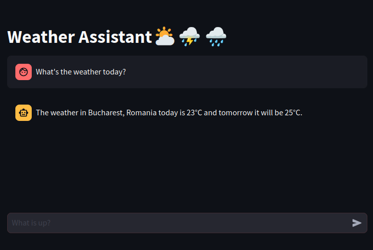
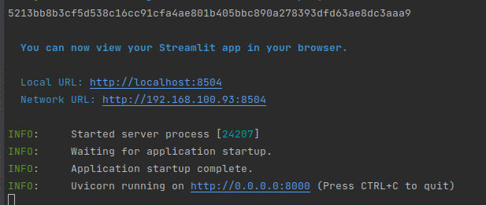
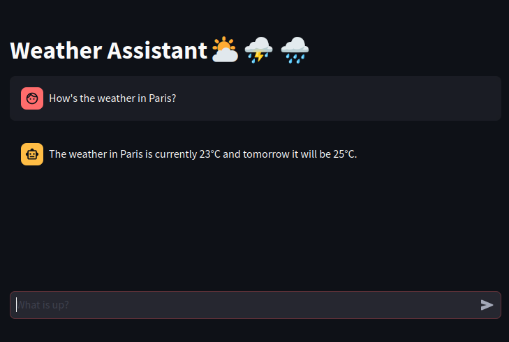
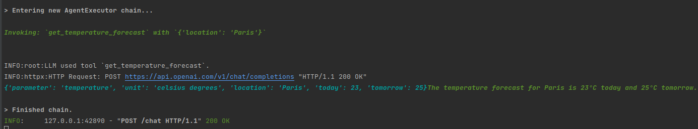
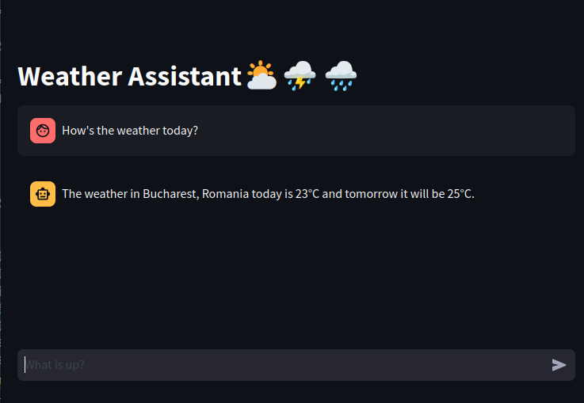
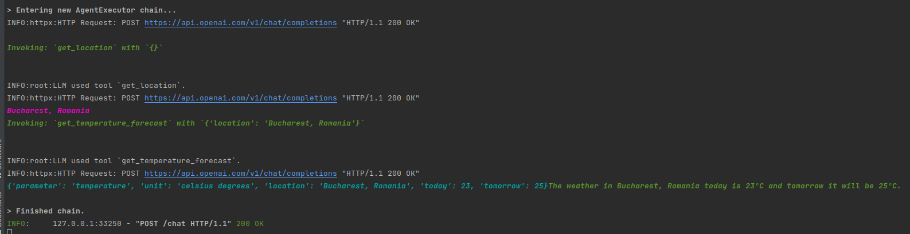
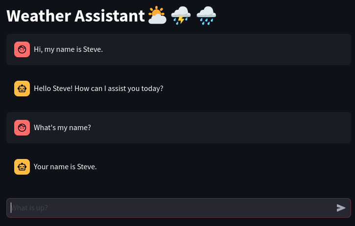

# Assistant-POC
Langchain assistant with tools and chat memory POC. Showcases the basic structure of a Chat Assistant that can call external functions.


## Start
You can start the service by calling `./start_asssiatnt.sh`. 
The Database service will be started as a Docker container (the id is printed in the terminal). 
Then after 5 seconds, the API and the UI are started. Access the services:

API: `http://0.0.0.0:8000/docs`
UI: `http://0.0.0.0:8501`

You should see something like this in the terminal:

- the first line is the id of the Docker container running the database.
- the second output (with blue) shows the logs of the Streamlit app
- the third stream of logs shows what happens in the Backend API 

When stopping the service, don't forget to also stop the database container `sudo docker stop [container_id]`

## Demo
You can interact with the Assistant from the UI. The idea is to showcase several functionalities in the backend langchain agent. 
For example, for a simple message, we can inspect the calls made in the backend:


We can see that the LLM agent used one of the tools we provided:


The tool is defined in `./lm_tools/tools.py`. For now, it's a dummy forecast (here you would add calls to some external weather APIs)
```python
@tool
def get_temperature_forecast(location: str) -> dict:
    """
    Get the temperature forecast for the current day and the next day at the specified location.
    :param location: string for the city for which the forecast is queried
    :return forecast: dictionary with forecast data
    """
    logging.info("LLM used tool `get_temperature_forecast`.")
    dummy_forecast = {
        'parameter': 'temperature',
        'unit': 'celsius degrees',
        'location': location,
        'today': 23,
        'tomorrow': 25
    }
    return dummy_forecast
```

### Multi-stage tool usage
Moreover, the agent is able to call sequences of tools, as needed. For example, take the message:

What's relevant here is that I have not provided any location for my forecast request. 
If we look at the tool definition, the forecast cannot be called without specifying a location. 
```python
def get_temperature_forecast(location: str) -> dict:
```
However, there's another useful tool the agent found:
```python
@tool
def get_location() -> str:
    """
    Get the current system location for the user.
    :return location: string specifying the user's current city.
    """
    logging.info("LLM used tool `get_location`.")
    city = 'Bucharest, Romania'
    return city
```
This, in practice, might be some tool that retrieves the user real-time location from GPS coordinates. 
Importantly, the agent learns that it should call this first and then call the `get_temperature_forecast` with its result.


### Chat History
An assistant would not be very useful without a bare minimum memory.
Therefore, we also implement a chat history so that it remembers what we previously said in the same chat session.


In the backend, this is accomplished by assigning a session id to each chat and when querying the backend we pass the `session_id` as a parameter. 
Without doing so, the LLM would not remember previous messages and treat each entry as a new one.
