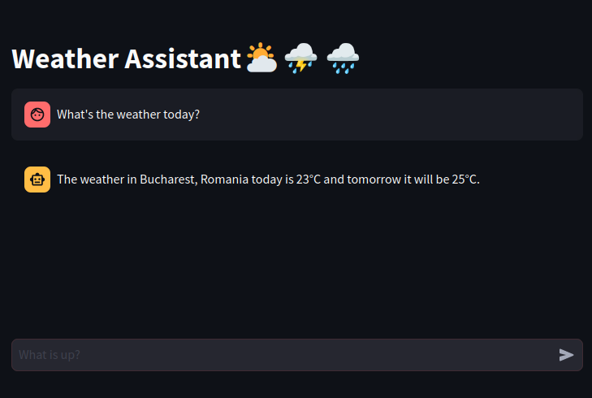

# Assistant-POC
Langchain assistant with tools and chat memory POC. Showcases the basic structure of a Chat Assistant that can call external functions.

## Start
You can start the service by calling `./start_asssiatnt.sh`. 
The Database service will be started as a Docker container (the id is printed in the terminal). 
Then after 5 seconds, the API and the UI are started. Access the services:

API: `http://0.0.0.0:8000/docs`
UI: `http://0.0.0.0:8501`

When stopping the service, don't forget to also stop the database container `sudo docker stop [container_id]`

## Demo
You can interact with the Assistant from the UI.

# Chat Messages